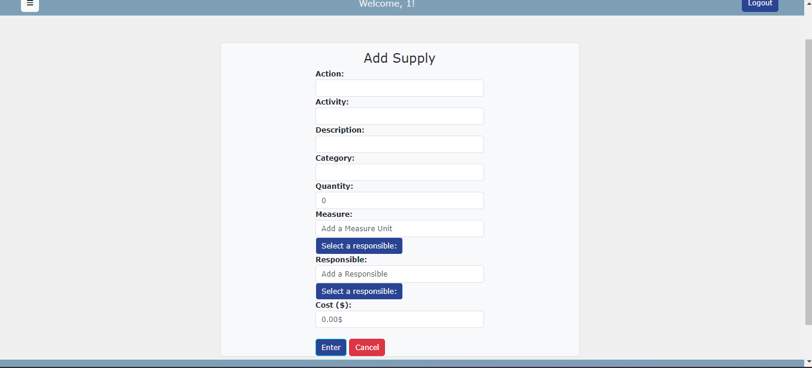
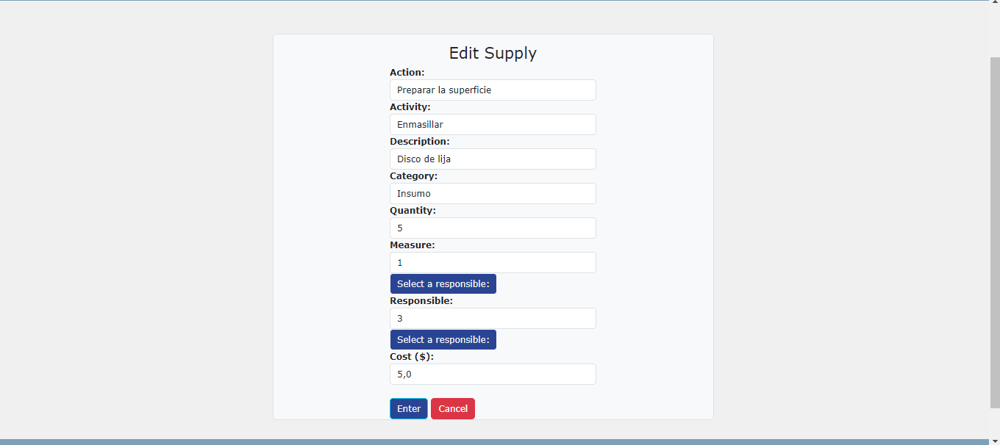

Guía del Usuario

Este documento es una guía para el uso de SAGTMA. Contiene guías visuales y permite dar a conocer al usuario las funcionalidades disponibles dentro del sistema.

Generalidades del sistema

Búsquedas 

Cada sección cuenta con búsquedas integradas para facilitar la visualización de la información. Las búsquedas tienen la siguiente forma:

Al dar click en el botón de drop down, se pueden observar diversas categorías que se pueden utilizar para filtrar la búsqueda. Estas categorías varían dependiendo de la sección en la que se encuentre el usuario.

Imagen presenta las categorías disponibles para la lista de usuarios.

Una vez seleccionada una categoría se puede introducir texto en la barra de búsqueda y al tocar enter, se realizará la búsqueda y se mostrarán los resultados encontrados en la tabla.

Para resetear la tabla a su estado original con todos los valores disponibles, se da click en el botón de búsqueda sin ninguna categoría seleccionada.

Eliminación de elementos

En cada una de las tablas en las diferentes secciones se encuentran unos botones con forma de papelera.

Al dar click en este botón, la información asociada con esta fila se eliminará y ya no existirá dentro del sistema.

Login

Al ingresar al sistema, si no se ha iniciado sesión, se muestra la pantalla de login que permite al usuario ingresar su nombre de usuario y contraseña.

Detalles del usuario

Al abrir la sesión, se ingresa a los detalles del usuario, que funciona como un perfil que contiene toda la información relacionada al usuario que inició sesión.

Menú

Es posible moverse en el sistema por medio del menú, existe un botón de menú con tres líneas horizontales en la esquina superior izquierda del sistema. 

Al darle click a este botón se abrirá un menú con las secciones disponibles dentro del sistema.

Lista de usuarios

Al abrir la lista de usuarios, se podrán visualizar todos los usuarios (trabajadores del taller) que tienen acceso al sistema, es posible verificar su información y el rol que cumplen en la tabla mostrada. 

Si se da click en el botón con forma de ojo, es posible visualizar los detalles de un usuario en particular.
También es posible crear un usuario al dar click en el botón con forma de persona. 

Registrar un nuevo usuario

new_user_button

Al registrar un usuario se deben incluir todos los datos que se piden en el formulario. Además se debe seleccionar un rol de permisos que le permitirá al usuario creado acceder o no a ciertas partes del sistema.

Una vez creado el usuario se puede visualizar en la lista de usuarios.

Editar un nuevo usuario
Al dar click en el botón de lápiz azul en la lista de usuarios, se puede editar la información de un usuario en particular.

Lista de clientes

Al abrir la lista de clientes, se puede observar una tabla que contiene todos los clientes que existen en el sistema, además se puede crear un nuevo cliente (botón con el símbolo +) o revisar el resto de la información asociada a un cliente en particular (botón verde con el símbolo del carro).

Añadir cliente
Al dar click en el botón con el símbolo + de la lista de clientes, se abrirá una nueva página con un formulario en el que se debe introducir la información completa del cliente a registrar.

Editar cliente
Similar a agregar un cliente, al dar click en el botón con símbolo de lápiz en la lista de clientes es posible editar los datos de un cliente ya existente.

Detalles del cliente

Al dar click en botón con el símbolo del carro en la lista de clientes, se ingresa a los detalles de un cliente en particular. 

En esta página se pueden observar los datos completos del cliente y los carros que han sido asociados a él. También es posible añadir más carros y editar los ya existentes.

Detalles del cliente - Añadir un carro

Para agregar un carro, se debe visitar los detalles del cliente que es dueño del carro y dar click en el botón con el símbolo + que se encuentra en la sección de carros.

Detalles del cliente - Editar un carro
Para editar un carro, se debe visitar los detalles del cliente que es dueño del carro y dar click en el botón con símbolo de lápiz en la lista de carros, luego se modifica la información deseada en el formulario.

Lista de Proyectos
Al abrir Proyectos, es posible observar una lista con los proyectos existentes para el taller. Se puede agregar un nuevo proyecto con el botón con un símbolo + y se puede visitar los detalles de cada proyecto y el presupuesto para el mismo.

Detalles del proyecto

Al ingresar a detalles del proyecto, en la parte superior derecha se pueden observar los botones para editar, inhabilitar, eliminar e imprimir un proyecto.
Luego se muestra la información del proyecto a modo de tabla.

Seguida por los planes de acción y los usuarios que forman parte del proyecto.

Agregar y eliminar usuarios al proyecto
Para agregar usuarios al proyecto se debe dar click en el botón con el símbolo + en la sección de Usuarios del Proyecto.

Luego se da click en el símbolo + al lado del usuario que se desea agregar, una vez listo esto dar click en el botón atrás y los usuarios han sido agregados.

Para eliminar usuarios al proyecto se debe dar click en el botón con el símbolo - en la sección de Usuarios del Proyecto.

Luego se da click en el símbolo - al lado del usuario que se desea agregar, una vez listo esto dar click en el botón atrás y los usuarios han sido eliminados.

Agregar un plan de acción
Los planes de acción pertenecen a un proyecto en particular, por lo que para añadir un plan de acción se debe entrar en los detalles del proyecto asociado y luego dar click en el botón con el símbolo + para abrir el formulario de creación de un nuevo plan de acción.

Para seleccionar un responsable del nuevo plan de acción a crear, se muestra un modal que permite seleccionar a uno de los usuarios existentes y se puede buscar el usuario mediante una barra de búsqueda que permite introducir el nombre o apellido del usuario.

Editar un plan de acción

Los planes de acción pertenecen a un proyecto en particular, por lo que para añadir un plan de acción se debe entrar en los detalles del proyecto asociado y luego dar click en el botón con el símbolo de lápiz y completar el formulario de la misma manera que al agregar un plan de acción.

Detalles del plan de acción
En la lista de planes de acción de un proyecto, se puede ingresar a los detalles, al dar click en el botón con forma de ojo. Luego se presenta una página que indica los datos del plan de acción.

Y tablas con el talento humano y los insumos asociados a este plan de acción.

Agregar talento humano a un plan de acción

Para agregar talento humano a un plan de acción a un plan de acción se debe dar click al botón con símbolo + en la sección de talento humano.

Para seleccionar un responsable del talento humano a crear, se muestra un modal que permite seleccionar a uno de los usuarios existentes y se puede buscar el usuario mediante una barra de búsqueda que permite introducir el nombre o apellido del usuario.

Editar talento humano de un plan de acción
Para editar el talento humano de un plan de acción se debe dar click al botón con símbolo de lápiz en la sección de talento humano.

Para seleccionar un responsable del talento humano, se muestra un modal que permite seleccionar a uno de los usuarios existentes y se puede buscar el usuario mediante una barra de búsqueda que permite introducir el nombre o apellido del usuario.

Agregar insumos de un plan de acción
Para crear un insumo de un plan de acción se debe dar click al botón con símbolo + en la sección de insumos.

Para seleccionar una medida del nuevo insumo a crear, se muestra un modal que permite seleccionar a uno de los usuarios existentes y se puede buscar el usuario mediante una barra de búsqueda que permite introducir el nombre de la unidad de medida.

Para seleccionar un responsable del insumo a crear, se muestra un modal que permite seleccionar a uno de los usuarios existentes y se puede buscar el usuario mediante una barra de búsqueda que permite introducir el nombre o apellido del usuario.

Editar insumos de un plan de acción

Para editar un insumo de un plan de acción se debe dar click al botón con símbolo de lápiz en la sección de insumos.

Para seleccionar una medida del nuevo insumo a editar, se muestra un modal que permite seleccionar a uno de los usuarios existentes y se puede buscar el usuario mediante una barra de búsqueda que permite introducir el nombre de la unidad de medida.

Para seleccionar un responsable del insumo a editar, se muestra un modal que permite seleccionar a uno de los usuarios existentes y se puede buscar el usuario mediante una barra de búsqueda que permite introducir el nombre o apellido del usuario.

Lista de Departamentos
Al abrir Departamentos, es posible observar una lista con los departamentos existentes para el taller. Se puede agregar un nuevo proyecto con el botón con un símbolo + y se puede editar un departamento en particular al dar click en el botón con forma de lápiz en la tabla.

Agregar un departamento

Editar un departamento

Lista de Unidades de Medida
Al abrir Unidades de Medida, es posible observar una lista con las unidades de medida existentes para el taller. Se puede agregar un nuevo proyecto con el botón con un símbolo de regla y se puede editar un departamento en particular al dar click en el botón con forma de lápiz en la tabla.

units_list

Agregar una unidad de medida

Editar una unidad de medida

Logger de Eventos
En esta sección es posible apreciar todos los movimientos realizados por el usuario que ha iniciado sesión.

